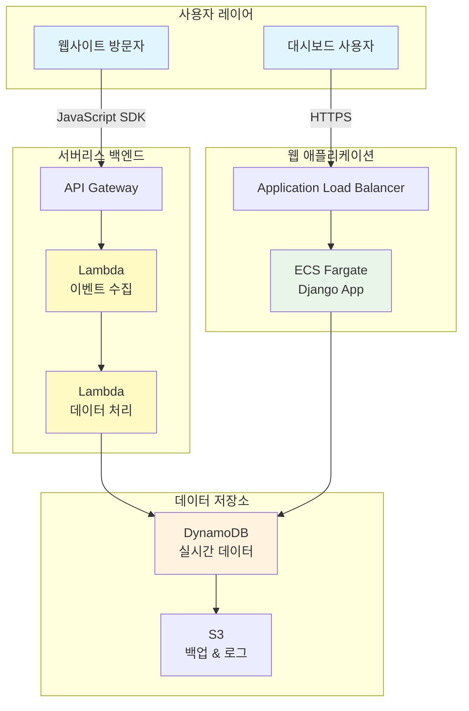

# Team13 : 실시간 웹사이트 방문자 분석 서비스 'LiveInsight'

**LiveInsight**는 웹사이트 운영자와 마케터가 방문자의 행동을 실시간으로 이해할 수 있도록 설계된 혁신적인 웹 분석 플랫폼입니다. 기존의 Google Analytics처럼 복잡한 설정이나 지연된 데이터 처리 없이, 직관적인 대시보드를 통해 "지금 이 순간" 웹사이트에서 일어나는 모든 일을 즉시 파악할 수 있습니다. 마치 매장에서 고객의 동선을 실시간으로 관찰하듯이, 웹사이트 방문자들이 어떤 페이지를 보고, 어떤 버튼을 클릭하며, 언제 이탈하는지를 초 단위로 추적하여 즉각적인 비즈니스 의사결정을 가능하게 합니다.


### 📊 제공하는 인사이트

**실시간 모니터링:**
- 현재 활성 사용자 수 및 세션 정보
- 페이지별 실시간 조회수 및 체류 시간
- 유입 경로별 트래픽 분포 (검색, 소셜, 직접 유입 등)
- 디바이스/브라우저별 사용 현황

**행동 분석:**
- 사용자 여정 맵 (어떤 순서로 페이지를 방문하는가)
- 클릭 히트맵 (어떤 요소를 가장 많이 클릭하는가)
- 스크롤 깊이 분석 (콘텐츠를 얼마나 읽는가)
- 이탈 지점 분석 (어디서 사용자가 떠나는가)

**비즈니스 메트릭:**
- 전환율 및 전환 퍼널 분석
- 고객 생애 가치 (CLV) 추적
- 리텐션 및 재방문율 분석
- ROI 및 마케팅 성과 측정

### 🚀 핵심 기능

**1. 실시간 이벤트 수집**
- JavaScript SDK를 통한 웹사이트 이벤트 추적
- 페이지뷰, 클릭, 스크롤, 폼 제출 등 자동 추적
- 커스텀 이벤트 정의 및 추적 (구매, 회원가입, 다운로드 등)
- 사용자 세션 및 디바이스 정보 자동 수집

**2. 서버리스 데이터 처리**
- AWS Lambda와 DynamoDB를 활용한 확장 가능한 데이터 처리
- 초당 수천 건의 이벤트 실시간 처리
- 자동 스케일링으로 트래픽 급증에도 안정적 처리
- 데이터 무결성 보장 및 중복 제거

**3. 실시간 대시보드**
- 방문자 현황, 페이지뷰, 이벤트 통계를 실시간으로 시각화
- 직관적인 차트와 그래프로 데이터 표현
- 모바일 반응형 디자인으로 언제 어디서나 모니터링
- 알람 및 임계값 설정으로 중요 이벤트 즉시 알림

## 🔥 주요 기능

### 실시간 이벤트 수집
LiveInsight의 실시간 이벤트 수집 시스템은 웹사이트 방문자의 모든 행동을 초 단위로 추적하는 혁신적인 시스템입니다. 기존 분석 도구들이 데이터 처리에 수시간에서 수일이 걸리는 반면, LiveInsight는 JavaScript SDK를 통해 페이지뷰, 클릭, 스크롤, 폼 제출 등의 이벤트를 즉시 추적하고 1초 이내에 대시보드에 반영합니다. 또한 비즈니스 특성에 맞는 커스텀 이벤트(구매, 회원가입, 다운로드 등)를 자유롭게 정의하여 추적할 수 있어, 각 비즈니스에 최적화된 분석이 가능합니다.

### 실시간 대시보드
LiveInsight의 대시보드는 복잡한 데이터를 직관적이고 아름다운 시각적 요소로 변환하여 제공합니다. 기존 분석 도구들이 수많은 메뉴와 옵션으로 인해 초보자들에게 혼란을 주는 반면, LiveInsight는 핵심 지표만을 선별하여 깔끔하게 배치했습니다. 현재 접속자 수, 페이지별 실시간 조회수, 유입 경로별 트래픽 분포, 디바이스별 사용 현황을 한 눈에 파악할 수 있으며, 모바일 반응형 디자인으로 언제 어디서나 모니터링이 가능합니다.


## 시스템 아키텍처




### 서버리스 아키텍처 (Phase 1-5)
- **API Gateway + Lambda**: 이벤트 수집 API
- **DynamoDB**: 실시간 데이터 저장
- **CloudWatch**: 모니터링 및 알람

### 웹 애플리케이션 (Phase 6-7)
- **ECS Fargate**: Django 웹 애플리케이션
- **Application Load Balancer**: 로드 밸런싱
- **Auto Scaling**: 자동 확장

## 리소스 배포하기

### 전체 배포 (권장)
```bash
# 전체 시스템 배포
./scripts/deploy.sh

# 배포 검증
./scripts/test.sh deployment
```

### 단계별 배포
```bash
# Phase 1-5: 서버리스 인프라
cd infrastructure && terraform apply

# Phase 6: 웹 애플리케이션
./scripts/deploy-phase6.sh

# Phase 7: 통합 테스트 및 최적화
./scripts/deploy-phase7.sh
```

### 리소스 삭제
```bash
# 전체 리소스 삭제
./scripts/cleanup.sh

# 또는 Terraform으로 삭제
cd infrastructure && terraform destroy
```
## 프로젝트 기대 효과 및 예상 사용 사례

### 기대 효과
1. **실시간 비즈니스 인사이트**: 웹사이트 성과를 실시간으로 모니터링
2. **데이터 기반 의사결정**: 사용자 행동 데이터를 통한 전략 수립
3. **전환율 최적화**: A/B 테스트와 사용자 여정 분석을 통한 개선
4. **비용 효율적 운영**: 서버리스 아키텍처로 트래픽에 따른 자동 확장

### 예상 사용 사례

#### 1. E-commerce 웹사이트
- 상품 페이지 조회 패턴 분석
- 장바구니 이탈률 분석
- 구매 전환 퍼널 최적화

#### 2. 미디어 및 콘텐츠 사이트
- 콘텐츠 인기도 실시간 추적
- 사용자 참여도 분석
- 광고 효과 측정

#### 3. SaaS 애플리케이션
- 사용자 온보딩 프로세스 분석
- 기능별 사용률 추적
- 사용자 리텐션 분석

#### 4. 마케팅 캠페인
- 캠페인 트래픽 실시간 모니터링
- 랜딩 페이지 성과 분석
- ROI 측정 및 최적화

### 확장 가능성
- **AI/ML 통합**: 예측 분석 및 개인화 추천
- **다중 플랫폼**: 모바일 앱, IoT 디바이스 지원
- **글로벌 확장**: 다중 리전 배포
- **엔터프라이즈 기능**: GDPR 컴플라이언스, SSO 통합
