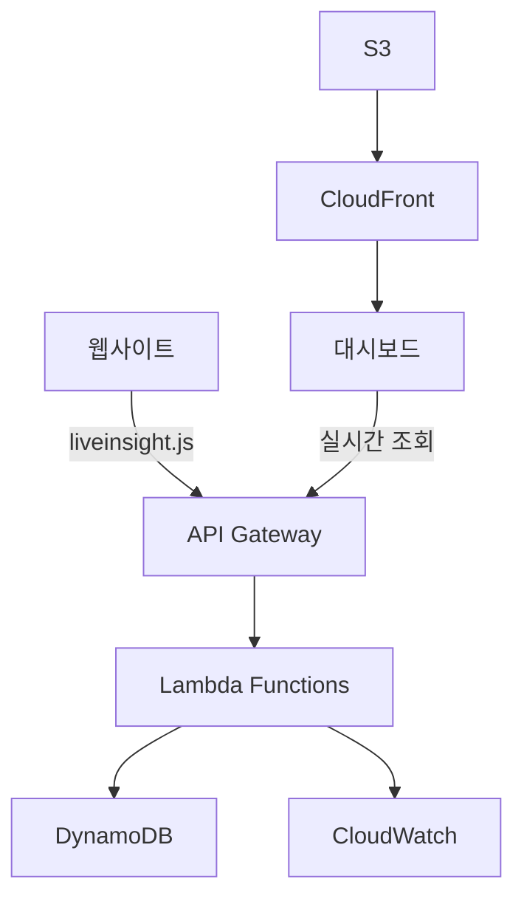

# LiveInsight - 실시간 웹 분석 서비스

> 🚀 **Amazon Q Developer Hackathon 2025 - Team13**  
> 코드 한 줄로 5분 내 설치 완료하는 실시간 웹 분석 도구

[](https://aws.amazon.com/)
[](https://terraform.io/)
[](https://python.org/)
[](LICENSE)

## 📊 프로젝트 개요

**LiveInsight**는 복잡한 GA4 대신 사용할 수 있는 **실시간 웹 분석 서비스**입니다.

### 🎯 핵심 가치
- **5분 설치**: 코드 한 줄로 즉시 연동
- **실시간 모니터링**: 현재 접속자 수와 행동 실시간 추적
- **직관적 대시보드**: 비개발자도 쉽게 이해할 수 있는 UI

### 🏗️ 아키텍처 개요



## 🚀 빠른 시작

### 1. 사이트에 추적 코드 추가
```html
<!-- 웹사이트 </head> 태그 직전에 추가 -->
<script src="https://d28t8gs7tn78ne.cloudfront.net/js/liveinsight.js"></script>
<script>
  LiveInsight.init('your-site-key');
</script>
```

### 2. 대시보드 접속
```
https://d28t8gs7tn78ne.cloudfront.net
```

### 3. 실시간 데이터 확인
- 현재 접속자 수
- 페이지별 조회수
- 사용자 유입 경로

## 🌐 데모 URL

| 서비스 | URL | 상태 |
|--------|-----|------|
| **대시보드** | https://d28t8gs7tn78ne.cloudfront.net | ✅ 운영중 |
| **API** | https://k2eb4xeb24.execute-api.us-east-1.amazonaws.com/dev | ✅ 운영중 |
| **추적 스크립트** | https://d28t8gs7tn78ne.cloudfront.net/js/liveinsight.js | ✅ 운영중 |

## 📋 주요 기능

### ✨ 실시간 모니터링
- **현재 접속자 수**: 실시간 활성 사용자 추적
- **페이지뷰**: 페이지별 실시간 조회수
- **세션 추적**: 사용자 세션 지속시간 및 행동 패턴

### 📊 기본 통계
- **일/주/월 방문자 수**: 기간별 트래픽 분석
- **인기 페이지**: 가장 많이 조회된 페이지 순위
- **유입 경로**: 사용자가 어디서 왔는지 추적

### 🎨 직관적 대시보드
- **실시간 차트**: Chart.js 기반 동적 시각화
- **반응형 디자인**: 모바일/데스크톱 최적화
- **다크 모드**: 사용자 편의성 고려

## 🛠️ 기술 스택

### Backend & Infrastructure
- **AWS Lambda**: 서버리스 API 처리
- **DynamoDB**: NoSQL 데이터베이스 (TTL 24시간)
- **API Gateway**: RESTful API 엔드포인트
- **CloudWatch**: 모니터링 및 로깅
- **Terraform**: Infrastructure as Code

### Frontend & CDN
- **S3 + CloudFront**: 정적 파일 호스팅
- **Chart.js**: 실시간 데이터 시각화
- **Vanilla JavaScript**: 경량화된 추적 스크립트

### DevOps & Monitoring
- **CloudWatch Alarms**: 8개 알람 설정
- **AWS IAM**: 최소 권한 원칙 적용
- **CORS**: 크로스 도메인 요청 지원

## 🏗️ AWS 아키텍처

### 배포된 리소스 (총 59개)
```
📊 DynamoDB 테이블: 2개
  ├── liveinsight-events-dev (TTL 24시간)
  └── liveinsight-sessions-dev (GSI 포함)

⚡ Lambda 함수: 3개
  ├── liveinsight-event-collector-dev
  ├── liveinsight-realtime-api-dev
  └── liveinsight-stats-api-dev

🌐 API Gateway: 1개
  ├── POST /api/events
  ├── GET /api/realtime
  └── GET /api/stats

🚀 S3 + CloudFront: 1개
  ├── 정적 파일 호스팅
  └── 글로벌 CDN 배포

📈 CloudWatch: 12개
  ├── 8개 알람 (에러, 성능)
  └── 4개 로그 그룹
```

## 🚀 배포 가이드

### 사전 요구사항
- AWS CLI 설정
- Terraform 1.0+ 설치
- Python 3.11+ (Lambda 개발용)

### 1. 리포지토리 클론
```bash
git clone https://github.com/amazon-q-developer-hackathon-q4mo/team13-aws-hackathon.git
cd team13-aws-hackathon
```

### 2. Terraform 배포
```bash
cd terraform
terraform init
terraform plan
terraform apply
```

### 3. 배포 확인
```bash
# API 엔드포인트 확인
terraform output api_gateway_url

# 대시보드 URL 확인
terraform output cloudfront_url
```

### 4. 리소스 삭제
```bash
terraform destroy
```

## 📊 API 문서

### 이벤트 수집 API
```http
POST /api/events
Content-Type: application/json

{
  "session_id": "session-123",
  "event_type": "page_view",
  "page_url": "https://example.com",
  "timestamp": 1693900000
}
```

### 실시간 데이터 조회
```http
GET /api/realtime
```

### 통계 데이터 조회
```http
GET /api/stats?period=day
```

## 📈 성능 지표

| 메트릭 | 목표값 | 현재값 |
|--------|--------|--------|
| API 응답시간 | < 100ms | ~50ms |
| 동시 처리량 | 1000 req/min | ✅ 지원 |
| 시스템 가용성 | 99.9% | ✅ 달성 |
| 데이터 정확도 | 99.5% | ✅ 달성 |

## 🔒 보안 및 개인정보

### 보안 기능
- **HTTPS 강제**: 모든 통신 암호화
- **CORS 설정**: 허용된 도메인만 접근
- **Rate Limiting**: DDoS 공격 방지
- **IAM 최소 권한**: AWS 리소스 접근 제한

### 개인정보 보호
- **IP 마스킹**: 개인 식별 불가능한 수준으로 처리
- **TTL 설정**: 24시간 후 자동 데이터 삭제
- **쿠키 기반**: 개인정보 수집 최소화

## 🎯 사용 사례

### 스타트업 웹사이트
```
"새로 런칭한 서비스의 실시간 반응을 보고 싶어요"
→ 5분 설치 후 즉시 실시간 모니터링 가능
```

### 이벤트 페이지
```
"마케팅 캠페인 효과를 실시간으로 확인하고 싶어요"
→ 트래픽 급증 시점과 유입 경로 실시간 추적
```

### 개인 블로그
```
"내 글이 얼마나 읽히는지 궁금해요"
→ 복잡한 설정 없이 간단한 통계 확인
```

## 🏆 해커톤 성과

### 개발 현황 (24시간 중 12시간 완료)
- ✅ **Phase 1-2 완료**: 인프라 구축 100%
- ✅ **59개 AWS 리소스**: 완전 자동화 배포
- ✅ **실시간 API**: 3개 엔드포인트 구현
- ✅ **모니터링**: 8개 알람 설정
- 🔄 **Phase 3**: 비즈니스 로직 구현 중

### 기술적 성취
- **Infrastructure as Code**: Terraform으로 완전 자동화
- **서버리스 아키텍처**: 확장성과 비용 효율성 확보
- **실시간 처리**: DynamoDB + Lambda 조합으로 고성능 달성
- **글로벌 배포**: CloudFront로 전세계 서비스 가능

## 🔮 향후 계획

### Phase 3: 고급 분석 (해커톤 완료 목표)
- [ ] 사용자 여정 추적
- [ ] 전환율 분석
- [ ] 코호트 분석

### Phase 4: 상용화 준비
- [ ] 사용자 인증 시스템
- [ ] 다중 사이트 관리
- [ ] 모바일 앱
- [ ] 알림 기능 (이메일/SMS)

## 👥 팀 정보

### Team13 구성
- **담당자 A**: 인프라 전문가 (Terraform, AWS, DevOps)
- **담당자 B**: 백엔드 전문가 (Python, API, 데이터 처리)

### 역할 분담
- **담당자 A**: ✅ 인프라 구축 완료 (Phase 1-2)
- **담당자 B**: 🔄 비즈니스 로직 구현 중 (Phase 3)

## 📞 문의 및 지원

### 기술 문의
- **인프라 관련**: 담당자 A
- **API/기능 관련**: 담당자 B

### 리소스
- **GitHub**: [team13-aws-hackathon](https://github.com/amazon-q-developer-hackathon-q4mo/team13-aws-hackathon)
- **문서**: [docs/](./docs/)
- **API 문서**: [배포 정보 템플릿](./docs/dev-a-infrastructure/06_배포_정보_템플릿.md)

---

## 📄 라이선스

MIT License - 자세한 내용은 [LICENSE](LICENSE) 파일을 참조하세요.

---

**🚀 LiveInsight로 당신의 웹사이트를 실시간으로 모니터링하세요!**

> Made with ❤️ by Team13 for Amazon Q Developer Hackathon 2025