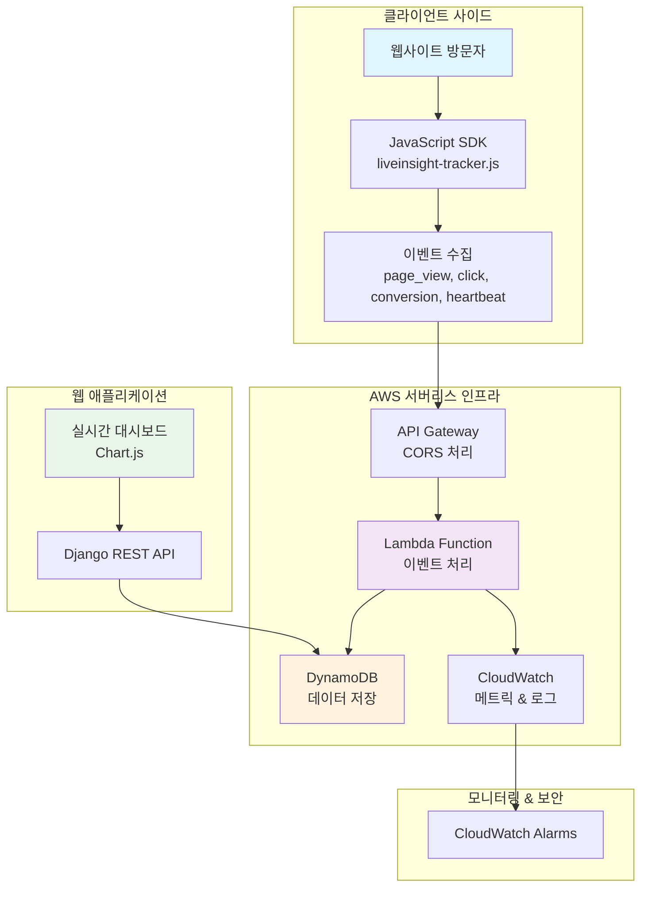
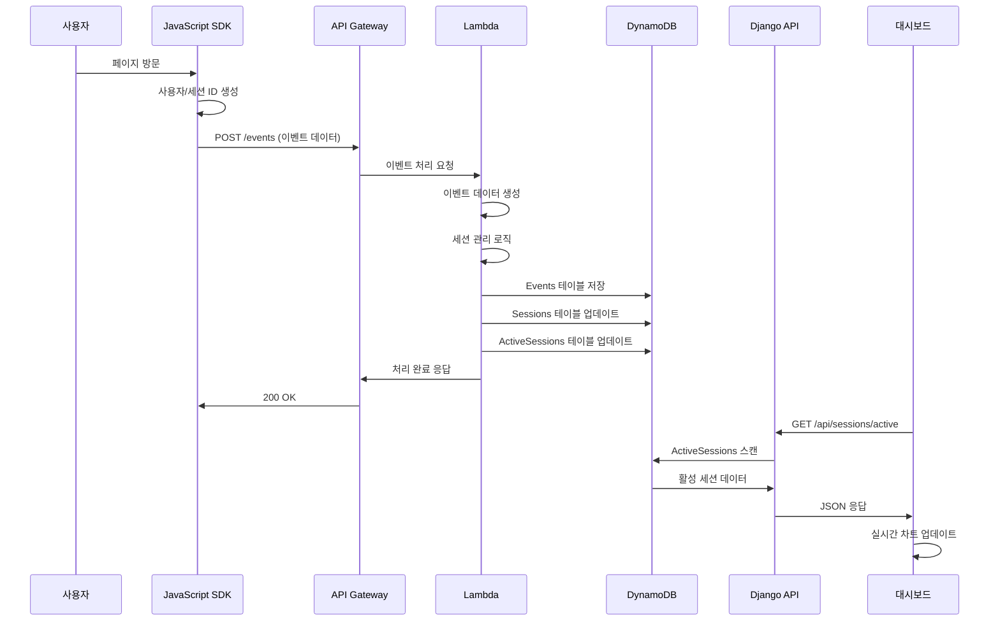
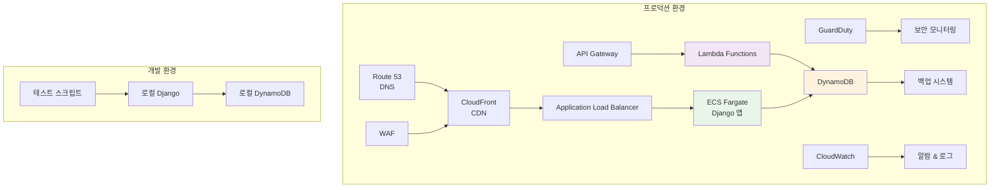
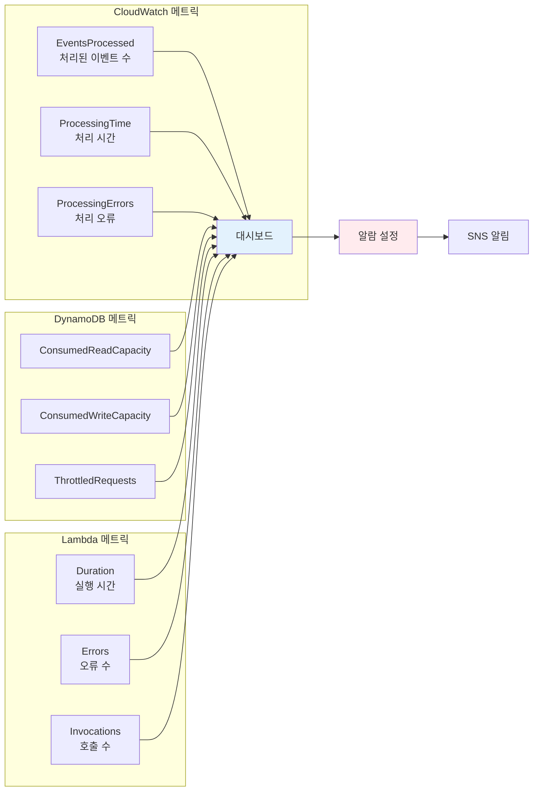

# LiveInsight 시스템 아키텍처 다이어그램

## 🏗️ 전체 시스템 아키텍처

## 📊 데이터 흐름 다이어그램

## 🚀 배포 아키텍처

## 📊 성능 메트릭 대시보드

이 다이어그램들은 LiveInsight 시스템의 전체적인 구조와 데이터 흐름을 시각적으로 보여줍니다. 각 컴포넌트 간의 관계와 데이터 처리 과정을 명확하게 이해할 수 있도록 구성했습니다.